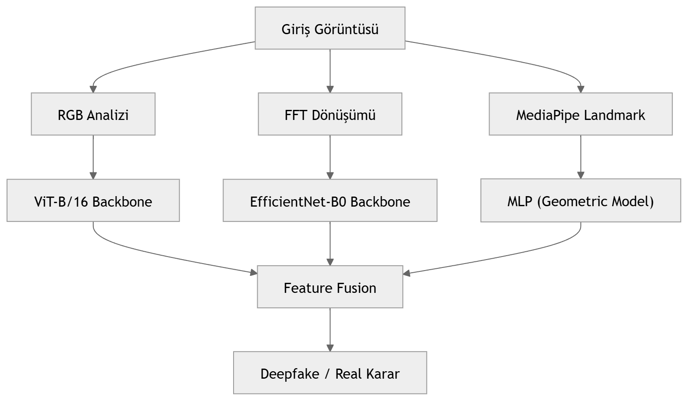
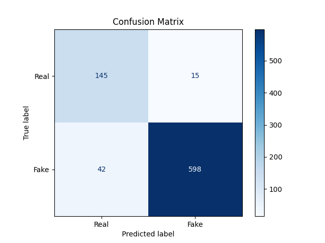
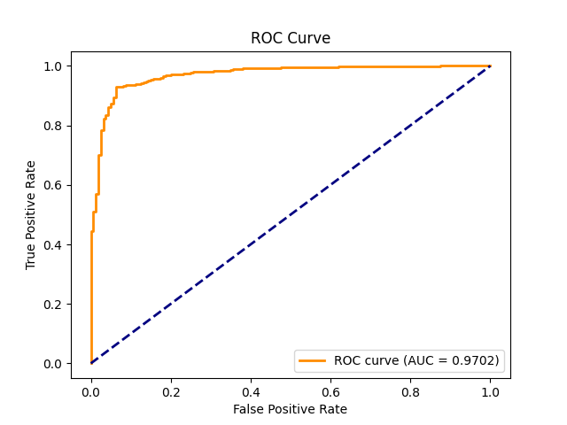
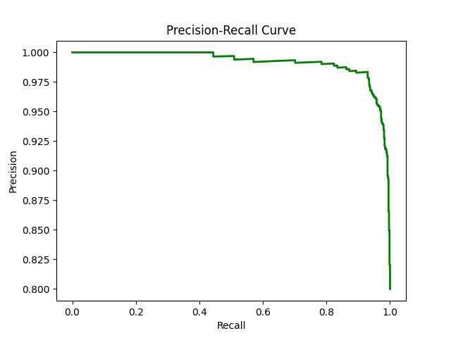

# 🧠 Deepfake Detection with MediaPipe + Multi-Feature Learning

#

Bu proje, deepfake tespiti performansını artırmak amacıyla **MediaPipe yüz geometrisi**, **RGB bozulmaları** ve **frekans (FFT) artefaktları** gibi çoklu özellikleri birleştiren hibrit bir yaklaşıma dayanmaktadır.

---

## 🚀 Projenin Amacı

Klasik deepfake tespit modelleri genellikle sadece piksel tabanlı öğrenmeye odaklanır. Bu projede ise:

- Görüntüdeki renk bozulmaları (RGB)  
- Yüzün geometrik yapısı (MediaPipe landmarkları)  
- Frekans uzayındaki artefaktlar (FFT)  

birlikte kullanılarak modelin doğruluğu artırılmıştır.

---

## 🧩 Kullanılan Yaklaşım

### 🔹 Backbone Mimarisi

- **ViT-B/16** → RGB özellikleri için  
- **EfficientNet-B0** → FFT özellikleri için  
- **MLP (Multi-Layer Perceptron)** → MediaPipe yüz geometrisi için  

Bu mimariler feature extraction için kullanılmıştır. RGB ve FFT modelleri önceden ImageNet ile ön eğitimli olup, head kısmı yeniden eğitilmiştir. Geo MLP modeli doğrudan 4 boyutlu yüz geometrisi vektörünü işler.

---

### 🔹 Multi-Modal Feature Extraction

Model üç farklı kaynaktan bilgi öğrenir:

#### 🎨 RGB Features
- Görüntüdeki renk bozulmalarını analiz eder  
- Deepfake üretiminde oluşan anormallikleri yakalar  

#### 📐 Geometric Features (MediaPipe)
- MediaPipe ile yüz landmark noktaları çıkarılır  
- Yüz oranları ve geometrik tutarsızlıklar öğrenilir  
- 4 özellik: gözler arası mesafe, ağız genişliği, burun-çene mesafesi, göz genişliği  

#### 🌊 Frequency Features (FFT)
- Görüntü frekans uzayına dönüştürülür  
- Deepfake üretiminde oluşan artefaktlar tespit edilir  

-
#### Multi-Features
- RGB → ViT-B/16  
- FFT → EfficientNet-B0  
- Geo → MLP  

üzerinde eğitim yapılır.  
Her modül ayrı ayrı eğitilir ve en iyi ağırlıklar `best_rgb.pth`, `best_fft.pth`, `best_geo.pth` olarak kaydedilir.

---

### 🧪 Model Ağırlıkları

- **best_rgb.pth** → RGB renk bozulmalarından öğrenilen ağırlıklar  
- **best_fft.pth** → Frekans (FFT) artefaktlarından öğrenilen ağırlıklar  
- **best_geo.pth** → Yüz geometrisinden öğrenilen ağırlıklar  

---
## 📊 Test / Evaluation Örnek Çıktısı

```text
===== BOOSTED RESULT =====
Accuracy: 0.9472
Precision: 0.9600
Recall: 0.9350
F1: 0.9474
IoU: 0.8951
```

Model üç farklı kaynaktan bilgi öğrenir:

#### 🎨 RGB Features
- Görüntüdeki renk bozulmalarını analiz eder  
- Deepfake üretiminde oluşan anormallikleri yakalar  

#### 📐 Geometric Features (MediaPipe)
- MediaPipe ile yüz landmark noktaları çıkarılır  
- Yüz oranları ve geometrik tutarsızlıklar öğrenilir  

#### 🌊 Frequency Features (FFT)
- Görüntü frekans uzayına dönüştürülür  
- Deepfake üretiminde oluşan artefaktlar tespit edilir  

---

## 📊 Neden Bu Yöntem Daha Başarılı?

Bu proje, tek bir veri tipine bağlı kalmak yerine:

- ✅ Görsel (RGB)  
- ✅ Geometrik (MediaPipe)  
- ✅ Frekans (FFT)  

bilgilerini birlikte kullanır.

Bu sayede:

- Daha **robust (dayanıklı)** model  
- Daha **yüksek doğruluk**  
- Manipülasyonlara karşı daha **genelleştirilebilir sistem**  

elde edilmiştir.

---

## ⚙️ Kullanım

```bash
# Repo klonla
git clone <repo_link>

# Script çalıştır
python DF34-18Mediapipe.py
```

---

### 🧠 Sistem Akışı
<p align="center">
  
</p>

### Confusion Matrix
<p align="center">
  
</p>

### ROC Curve
<p align="center">
  
</p>

### Precision-Recall
<p align="center">
  
</p>

